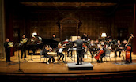
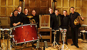

---
composer:
  first: Jason
  last: Thorpe Buchanan
title: "Double Concerto for Two Horns and Chamber Orchestra"
duration: 8 minutes
yearComposed: 2014
commissionedOrWrittenFor: Commissioned by the International Horn Society for the Eastman Music Nova Ensemble, Jeff Nelsen, Mike Walker, and Brad Lubman
size: "chamber orchestra"
instrumentation:
  - 1.1.2.1-4.1.1.0-3 Perc-1.1.1.1.1
  - flute
  - oboe
  - clarinet
  - bass clarinet
  - bassoon
  - 4 horns
  - trumpet
  - trombone
  - 3 percussionists
  - 1st violin
  - 2nd violin
  - viola
  - cello
  - contrabass
tags:
  - acoustic
  - orchestra
media:
  - title: "Double Concerto (2014) for Two Horns and Chamber Orchestra by Jason Thorpe Buchanan"
    url: https://player.vimeo.com/video/110432545
headerImage: works-images/doubleconcerto_full.jpg
portWrapper: works-images/port-wrapper/doubleconcerto_620x390.jpg
score: score_double-concerto.html
awards: "Commissioned by the International Horn Society 
Winner, 2015 ASCAP Morton Gould Award"
dedication: "For Jeff Nelsen, Mike Walker, Brad Lubman, and the Eastman Musica Nova Ensemble"
purchase: "Digital Score PDF: $19.95, Score and Parts (RENTAL ONLY): $149.95"
contact: jasontbuchanan[at]gmail.com

---

<em>Double Concerto for two horns and chamber orchestra</em> was written between November 2013 and March 2014, premiered by Jeff Nelsen, Michael Walker, and the Eastman Musica Nova Ensemble with conductor Brad Lubman on March 21, 2014. In 2008, I had written Mike Walker a work for horn and electronics that I now consider a turning point in my creative output, and throughout my undergraduate studies he remained one my closest friends and colleagues. The seed was planted for a horn concerto as far back as March 2011 through correspondence with Mike, and by June we had confirmed our plans to collaborate. The following year Mike suggested that I write a double concerto for himself and Jeff Nelsen, an exciting prospect and opportunity to explore the musical relationship between two hornists. We discussed the use of a "fluid" early valve horn technique that would utilize the natural partials available on each of the instruments, following in the footsteps of Ligeti's Horn Trio (1982) and Hamburg Concerto (1998-99; 2003), one of his last works. Ligeti writes about his own work on the Hamburg Concerto: "In this piece I experimented with very unusual non-harmonic sound spectra. In the small orchestra there are four natural horns, each of which can produce the 2nd to the 16th overtone. By providing each horn or group of horns with different fundamentals I was able to construct novel sound spectra from the resulting overtones. These harmonies, which had never been used before, sound "weird" in relation to harmonic spectra. I developed both "weird" consonant and dissonant harmonies, with complex beats."   
My own Double Concerto utilizes four valved horns, the two soloists accompanied by two obbligato horns in the ensemble, each freely alternating between valved and natural horn technique. In this work I sought to explore my (complex) relationship as a composer to classical repertoire, and in the same way that Ligeti draws from Brahms, I in turn take a page or two from Ligeti's book, among others. Throughout my creative life, perhaps no other composer has had such a strong an influence on me; he was the first living composer I became aware of, and I was immediately fascinated by his music. While living in Hamburg from 2010-11 I had the opportunity to study with a number of his former students and close colleagues, including Manfred Stahnke who helped me begin to raise many important questions in regard to my own creative process. I like to think of this work as a return of sorts after several years questioning the relevancy of pitch as a larger artistic dilemma; what is it about pitch that we as composers, performers, and listeners gravitate towards, perhaps above all else? We acknowledge music as organized sound, and thus all intentionally organized sound may be considered music. Yet, I find that the majority of composers, even today, remain fixated on this musical parameter more than any other.  In the last three years I have quite intentionally been working to neutralize definite pitch and harmony in my works, favoring the exploration of nearly all other musical parameters and inharmonic spectra. For me, the horn is an instrument that is simultaneously very powerful and yet somehow still extremely fragile and organic in character. In being confronted with a musical situation featuring two horn soloists, I was faced to deal head-on with the issue of pitch within the context of my own musical language.   
Many thanks both to Brad Lubman and Jeff Nelsen, without whom this undertaking would not have been possible. This commission was funded in part by the Meir Rimon Commissioning Assistance Program of the International Horn Society.

  
World Premiere: Rochester, NY - March 21, 2014 
Eastman Musica Nova Ensemble, conductor Brad Lubman, soloists Jeff Nelsen & Michael Walker 
Commissioned by the International Horn Society 
Winner, 2015 ASCAP Morton Gould Award

<ul><li> 

 </li></ul>

<!--

<iframe width="98%" height="20" scrolling="no" frameborder="no" src="https://w.soundcloud.com/player/?url=https%3A//api.soundcloud.com/tracks/147312494&amp;color=ff5500&amp;inverse=true&amp;auto_play=false&amp;show_user=false"></iframe>

	    -->
